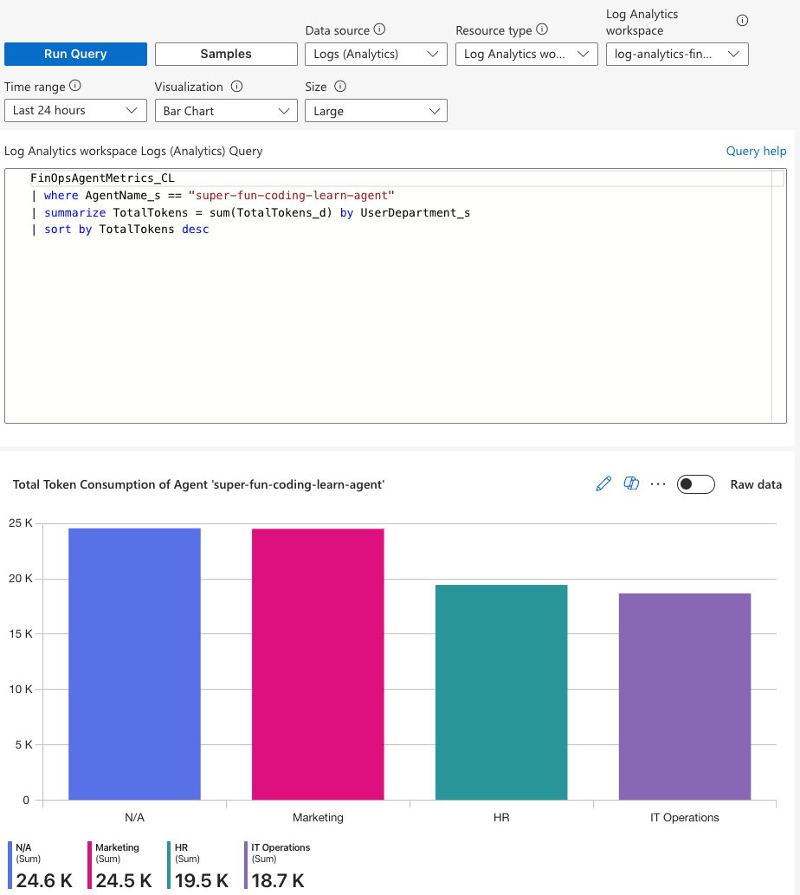
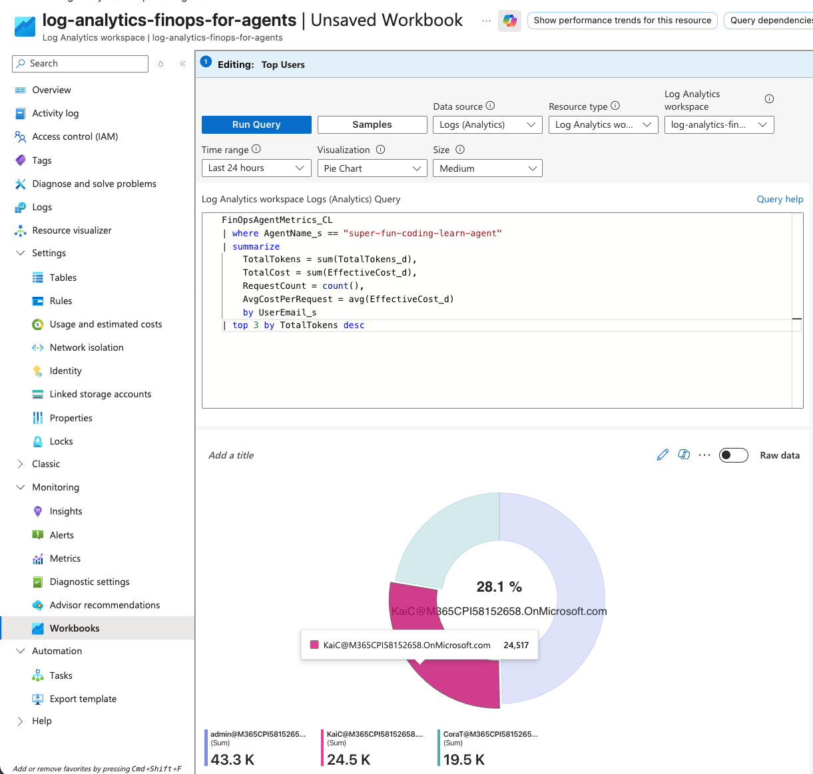
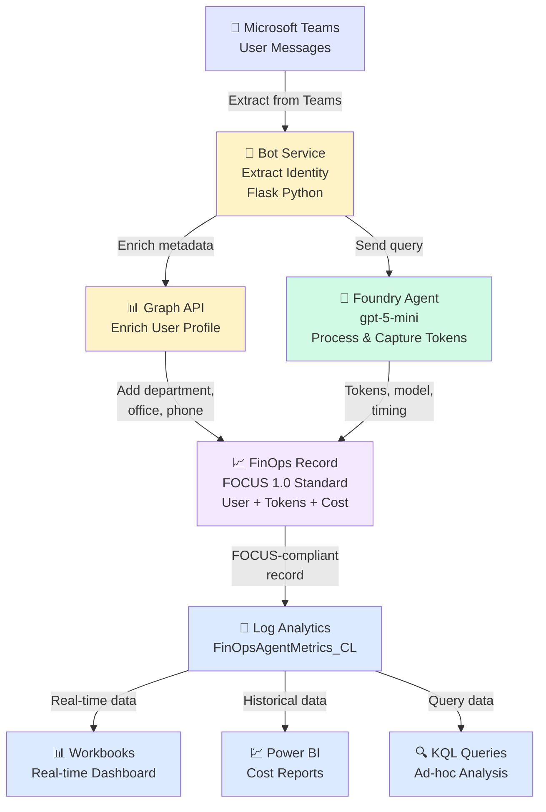
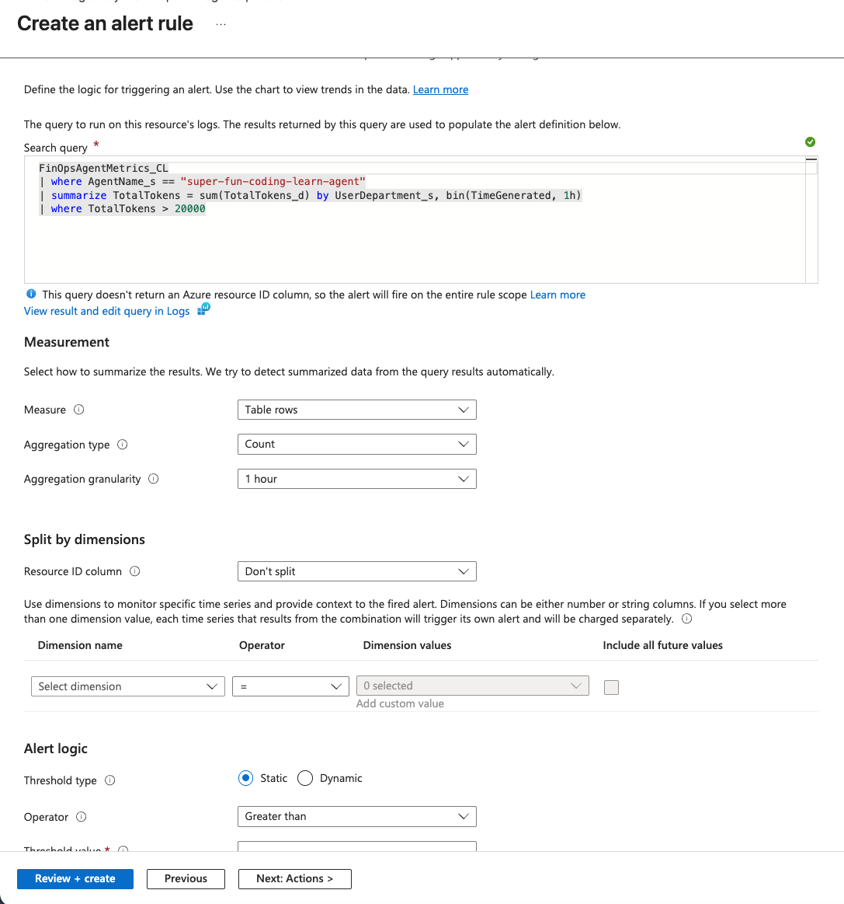

# FinOps for Agents



*This dashboard shows real-time token consumption by department for the super-fun-coding-learn-agent. Each bar represents total tokens (input + output) consumed by a department. Anomalies are automatically detected and highlighted—departments with unusually high consumption stand out for optimization and cost control.*

---

## Top Users - Sample Analysis



*This analysis identifies the highest-consuming users for the agent. Each user's total tokens, cost, and request count are tracked, enabling targeted optimization and efficiency improvements.*

---

**Enable cost transparency and user-level attribution for AI agent consumption using FinOps Foundation standards**

---

## Current Situation

Organizations are rapidly deploying AI agents to automate processes, democratize access to knowledge, and empower employees. However, unlike infrastructure costs (compute, storage), **AI usage costs are consumption-driven**: every token processed, every model call, every agent execution carries a cost.

Today's cost visibility is limited:
- **Centralized only**: Costs are tracked at the platform or agent level
- **Opaque attribution**: Who is actually driving these costs? Which teams, departments, or business processes?
- **No allocation**: Without user-level metrics, organizations cannot implement showback, chargeback, or cost optimization

This creates a gap: **strong adoption, weak financial control**.

---

## Challenge

As AI agent investments scale, organizations face critical questions they cannot answer:

- **Which agents deliver ROI?** Without per-user costs, you cannot correlate agent usage to business outcomes
- **Where are optimization opportunities?** You don't know which users, teams, or use cases are driving excessive token consumption
- **How do we budget for AI?** Without granular cost data, budgeting becomes guesswork
- **Can we implement chargeback?** Showback requires attribution; chargeback requires both attribution and allocation rules

The result: **AI costs remain a black box**, limiting the organization's ability to scale agents responsibly and cost-effectively.

---

## Solution Approach

**FinOps for Agents** applies proven FinOps Foundation practices to the AI agent context. Rather than creating an isolated cost model, we extend the established FinOps framework to include **agent-specific cost drivers**:

- **User identity** (from Teams, Microsoft 365, or other entry points)
- **Token consumption** (input, output, reasoning tokens)
- **Agent and model tracking** (which agent, which version, which model)
- **Cost attribution** (map costs to users, teams, departments, business processes)
- **Standardized schemas** (using the FOCUS 1.0 framework from FinOps Foundation)

### Key Design Principles

✅ **Framework-Aligned**: Built on FinOps Foundation FOCUS standard for seamless integration into existing cost governance  
✅ **User-Native Attribution**: Capture identity at the source (Teams, API) to enable true cost allocation  
✅ **Real-Time Metrics**: Stream token usage and costs immediately upon agent execution  
✅ **Cloud-Native**: Leverage Azure Log Analytics, Application Insights, and Workbooks for scalable storage and visualization  
✅ **Extensible**: Add new agents, users, teams without code changes; configuration-driven  

### Implementation: Microsoft Foundry + Teams Integration

This solution demonstrates the approach using:
- **Entry Point**: Microsoft Teams (user chat interface)
- **Identity Source**: Teams + Microsoft Graph API (user metadata enrichment)
- **Agent Runtime**: Microsoft Foundry (agentic AI execution)
- **Metrics Pipeline**: Bot middleware → FinOps schema → Log Analytics → Power BI/Workbooks
- **Cost Allocation**: Department, team, or individual-level chargeback

---

## Business Value

Organizations unlock three core capabilities:

### 1. **Financial Visibility & Control**
- See exactly which users, teams, and departments drive AI costs
- Implement **showback** (informational reporting) and **chargeback** (cost recovery) models
- Budget AI investments with data, not estimates

### 2. **Optimization Opportunities**
- Identify high-consumption users and optimize their workflows
- Compare token efficiency across agents, models, and use cases
- Right-size agent deployments based on actual demand

### 3. **Governance & Scale**
- Track adoption patterns and align with business strategy
- Enforce cost controls via policy (daily/monthly cost caps)
- Scale agents responsibly with clear ROI visibility

### Business Outcomes
- **10-30% cost reduction** (through optimization of high-consumption patterns)
- **Improved adoption ROI** (link AI investments to business KPIs)
- **Predictable budgeting** (replace guesswork with data)
- **Stakeholder alignment** (finance, business units, IT teams understand cost trade-offs)

---

## Target State

**User-native token consumption tracking for agentic AI, built on FinOps Foundation standards.**

### What We Enable

1. **Real-Time Metrics Collection**
   - Every agent interaction captures: user identity, tokens consumed, model used, processing time, cost
   - FOCUS-compliant schema ensures compatibility with enterprise FinOps tools

2. **Transparent Cost Attribution**
   - Users see their own consumption (self-service cost visibility)
   - Finance teams implement chargeback policies
   - Business units align AI spending with strategy

3. **Scalable Reporting & Dashboards**
   - Azure Workbooks for operational dashboards (real-time agent performance)
   - Power BI for financial analysis (cost trends, departmental allocation)
   - Log Analytics for ad-hoc queries and anomaly detection

4. **Extensible Architecture**
   - Add new agents without modifying infrastructure
   - Support multiple entry points (Teams, API, portal)
   - Integrate with existing Azure cost management and governance tools

### Integration Path

This solution is **designed for integration into existing FinOps processes**:
- Export to FinOps Center of Excellence (FOCE) cost models
- Feed into Kubernetes/container FinOps for hybrid workload analysis
- Connect to chargeback and allocation engines

Organizations can deploy this pattern across any agentic AI workload—not just Teams + Foundry—because the underlying schema and pipeline are **provider-agnostic**.

---

## Architecture

### High-Level Data Flow

```
User (Teams)
    ↓
Bot Service (Extract Identity)
    ↓
Graph API (Enrich User Profile)
    ↓
Foundry Agent (Process Request, Capture Metrics)
    ↓
FinOps Record Creation (FOCUS-Compliant Schema)
    ↓
Log Analytics (Store Metrics)
    ↓
Dashboards (Visualize & Report)
    ↓
Chargeback/Optimization (Action)
```

### Component Architecture

```
┌─────────────────────────────────────────────────────────────────┐
│                        Microsoft Teams                          │
│                    (User Entry Point)                           │
└────────────────────────────┬────────────────────────────────────┘
                             │
                ┌────────────▼──────────────┐
                │   Azure Bot Service       │
                │  (Message Routing)        │
                └────────────┬──────────────┘
                             │
        ┌────────────────────┼────────────────────┐
        │                    │                    │
    ┌───▼────┐        ┌─────▼────┐        ┌─────▼────┐
    │  Teams │        │  Graph   │        │ Foundry  │
    │ Extact │        │   API    │        │  Agent   │
    │Identity│        │ Enrich   │        │ Execute  │
    └────┬───┘        └─────┬────┘        └─────┬────┘
         │                  │                   │
         └──────────────────┼───────────────────┘
                            │
                 ┌──────────▼──────────┐
                 │  FinOps Metrics     │
                 │ - User Identity     │
                 │ - Token Counts      │
                 │ - Agent Metadata    │
                 │ - Cost Estimate     │
                 └──────────┬──────────┘
                            │
                 ┌──────────▼──────────┐
                 │  Log Analytics      │
                 │  Workspace          │
                 │ (FinOpsAgentMetrics)│
                 └──────────┬──────────┘
                            │
         ┌──────────────────┼──────────────────┐
         │                  │                  │
    ┌────▼───┐      ┌──────▼────┐      ┌─────▼──┐
    │ Workbook│      │  Power BI  │      │ KQL   │
    │ Dash    │      │  Reports   │      │Queries│
    └─────────┘      └────────────┘      └───────┘
```

### Architecture Diagram



**Or view the detailed SVG diagram:** [FinOps Architecture (SVG)](./images/architecture-diagram.svg)

---


### Key Metrics Visible

| Metric | Meaning |
|--------|---------|
| **Total Tokens** | Sum of input + output tokens for all interactions |
| **Cost** | Estimated cost based on token pricing ($0.00001/input, $0.00003/output) |
| **Request Count** | Number of agent interactions |
| **Average Cost/Request** | Cost per interaction (token efficiency) |

---

## Technology Stack

### Backend & Cloud
- **Cloud Platform**: Microsoft Azure (Sweden Central)
- **Infrastructure as Code**: Terraform
- **Agent Runtime**: Microsoft Foundry (Azure AI Services)
- **Bot Framework**: Azure Bot Service
- **Metrics Storage**: Azure Log Analytics + Application Insights
- **Local Middleware**: Python 3.11 + Flask 3.0.0

### APIs & Services
- **Microsoft Graph API** - User profile and directory data
- **Azure Bot Connector** - Bot-to-Teams communication
- **Foundry Responses Protocol** - Agent endpoint (OpenAI-compatible)
- **Log Analytics Data Collector API** - Custom metrics ingestion

### FinOps & Standards
- **FOCUS 1.0 Framework** - Cost and usage specification (FinOps Foundation)
- **JSON Schema Draft 2020-12** - Data model validation
- **Kusto Query Language (KQL)** - Metrics analysis and reporting

### Authentication & Security
- **Azure AD (Entra ID)** - OAuth 2.0 client credentials flow
- **Role-Based Access Control (RBAC)** - Foundry Agent Consumer role
- **Token Management** - Separate tokens for Bot Framework, Graph API, and Foundry

---

## Key Metrics Captured

For each user-agent interaction, the system captures **40+ fields** organized across these categories:

| Category | Metrics |
|----------|---------|
| **User Attribution** | Email, department, office location, job title, phone, AAD ID |
| **Agent Execution** | Agent name, version, model, execution status |
| **Token Usage** | Input tokens, output tokens, reasoning tokens, total tokens |
| **Cost** | Effective cost (calculated from token prices) |
| **Performance** | Processing time (seconds), tokens per second |
| **Billing** | Billing account, billing period, charge period |
| **Geographic** | Region, location metadata |
| **Timestamp** | Created at, completed at (for trend analysis) |

All metrics follow the **FOCUS 1.0 standard** for seamless integration into existing FinOps pipelines.

---

## Getting Started

### Prerequisites

- Python 3.11+
- Azure subscription with:
  - Foundry project and agent deployed
  - Bot Service app registered
  - Log Analytics workspace
- Azure CLI or DevTunnel installed
- Access to Microsoft Teams

### Quick Start (Local)

```bash
cd code

# Set up Python environment
python3.11 -m venv venv
source venv/bin/activate

# Install dependencies
pip install -r requirements.txt

# Configure environment
cat > .env << EOF
BOT_APP_ID=3b9d4a32-20a4-44e3-b62a-46087da55e72
BOT_APP_PASSWORD=<your-password>
LOG_ANALYTICS_SHARED_KEY=<your-shared-key>
EOF

# Run bot service
python bot_service.py

# In another terminal, expose to internet
devtunnel host -a -p 3978
```

### Query Metrics in Log Analytics

```kql
FinOpsAgentMetrics_CL
| where AgentName_s == "super-fun-coding-learn-agent"
| summarize 
    TotalTokens = sum(TotalTokens_d),
    TotalCost = sum(EffectiveCost_d),
    Requests = count()
    by UserEmail_s
| sort by TotalTokens desc
```

### View Dashboards

1. **Azure Workbook**: Log Analytics → Workbooks → Import `dashboards/finops-dashboard.json`
2. **Power BI**: Connect to Log Analytics workspace and build custom reports

### Anomaly Detection & Cost Alerts

Monitor token consumption anomalies in real-time with automated alerts:

**KQL Query for Anomaly Detection:**

```kql
FinOpsAgentMetrics_CL
| where AgentName_s == "super-fun-coding-learn-agent"
| make-series TotalTokens = sum(TotalTokens_d) on TimeGenerated step 1h by UserDepartment_s
| extend anomalies = series_decompose_anomalies(TotalTokens, 1.5)
| render anomalychart
```

This query:
- Groups token consumption by department over 1-hour periods
- Automatically detects anomalies (unusual spikes or dips)
- Visualizes departments with high/low consumption

**Setting Up Alert Rules:**

1. Go to **Log Analytics** → **Alerts** → **Create alert rule**
2. Use this query to alert on high consumption:
   ```kql
   FinOpsAgentMetrics_CL
   | where AgentName_s == "super-fun-coding-learn-agent"
   | summarize TotalTokens = sum(TotalTokens_d) by UserDepartment_s, bin(TimeGenerated, 1h)
   | where TotalTokens > 20000
   ```
3. Configure:
   - **Threshold**: 20,000 tokens/hour (adjust as needed)
   - **Frequency**: Every 1 hour
   - **Action**: Email/Teams notification
4. Enable the alert rule



*Alert rules automatically notify operations teams when departments exceed token consumption thresholds, enabling proactive cost management and optimization.*

### Top Users Analysis

Identify and monitor your highest-consuming users for optimization and cost management:

**KQL Query for Top Users:**

```kql
FinOpsAgentMetrics_CL
| where AgentName_s == "super-fun-coding-learn-agent"
| summarize 
    TotalTokens = sum(TotalTokens_d),
    TotalCost = sum(EffectiveCost_d),
    RequestCount = count(),
    AvgCostPerRequest = avg(EffectiveCost_d)
    by UserEmail_s
| top 5 by TotalTokens desc
```

This query returns:
- **User Email**: Email address of the user
- **Total Tokens**: Sum of all tokens consumed
- **Total Cost**: Estimated cost for that user
- **Request Count**: Number of interactions
- **Avg Cost/Request**: Average cost per query (efficiency metric)


*This analysis enables targeted optimization: reach out to high-consumption users to improve query efficiency, identify training needs, or optimize agent usage patterns.*

---

## Project Structure

```
finops-for-agents/
├── code/                          # Python bot service
│   ├── bot_service.py            # Main Flask app
│   ├── user_metadata.py          # Teams + Graph API integration
│   ├── foundry_agent.py          # Foundry agent calls
│   ├── finops_metrics.py         # FinOps record creation & validation
│   └── requirements.txt           # Python dependencies
├── finops_data_layer/             # FinOps schema & validation
│   ├── finops_schema.py          # FOCUS-compliant data model
│   ├── schema.json               # JSON Schema definition
│   └── README.md                 # Data model documentation
├── infra/                         # Terraform infrastructure
│   ├── main.tf                   # Azure resources
│   └── outputs.tf                # Resource outputs
├── dashboards/                    # Azure Workbooks
│   └── finops-dashboard.json     # Sample dashboard template
├── images/                        # Documentation images
│   ├── token-consumption-by-user.svg
│   └── architecture-diagram.svg
├── code/SETUP.md                 # Detailed setup guide
└── README.md                     # This file
```

---

## Next Steps

1. **Deploy Infrastructure**: Run `terraform apply` to create Log Analytics, Application Insights, and Foundry resources
2. **Start Bot Service**: Run the Python bot service locally and expose with DevTunnel
3. **Send Test Messages**: Interact with the bot from Teams and watch metrics flow to Log Analytics
4. **Build Reports**: Use Workbooks or Power BI to visualize and analyze costs by user/team/department
5. **Implement Chargeback**: Use the metrics to allocate costs back to business units

---

## Support & Contributing

For questions, issues, or contributions, please open an issue in the project repository.

This solution is part of the **FinOps for Agents initiative** to bring transparent, standardized cost management to AI agentic workloads.

---

*Built with ❤️ for the FinOps Foundation*
