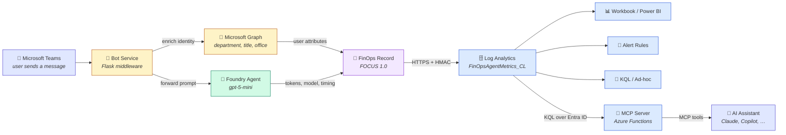

<div align="center">

# FinOps for Agents

**Know exactly who is spending what on your AI agents — down to the token.**

A reference implementation that captures per-user, per-agent token consumption from
Microsoft Foundry agents, converts it into [FOCUS™ 1.0](https://focus.finops.org/)-compliant
cost records, and streams it to Azure Log Analytics for reporting, chargeback and alerting —
then exposes that data back to AI assistants over [MCP](#ask-your-data-in-natural-language),
so you can ask "who spent the most on this agent last month?" in plain English.

[Why](#why-this-exists) · [How it works](#architecture) · [Quickstart](#quickstart) · [Queries](#querying-your-data) · [MCP](#ask-your-data-in-natural-language) · [Limits](#known-limitations) · [Roadmap](#roadmap)

</div>

---


<sub>*Live token consumption per department for a single Foundry agent. Every bar is real usage attributed back to a cost centre — the basis for showback, chargeback and optimisation.*</sub>

---

## Why this exists

Organisations are deploying AI agents fast. Their finance teams cannot keep up.

Unlike compute or storage, **AI agent cost is consumption-driven**: every token processed by
every user carries a price. But the bill that arrives at the end of the month is a single
number per model deployment. There is no answer to the questions that actually matter:

| Question | Can you answer it today? |
|---|---|
| Which department is driving 40% of our agent spend? | ❌ |
| Is this agent worth the money it costs to run? | ❌ |
| Which users are burning tokens on inefficient prompts? | ❌ |
| What should we budget for AI next quarter? | ❌ |
| Can we charge these costs back to the business units using them? | ❌ |

The result is a familiar pattern: **strong adoption, weak financial control.** Teams either
over-provision and waste money, or freeze adoption because nobody can defend the spend.

### What this project changes

`FinOps for Agents` closes the attribution gap at the point of consumption. It sits between
the user and the agent, enriches every request with organisational identity, captures the exact
token usage the model reports back, and writes a standards-compliant cost record.

- **Attribution at source** — identity is captured from Teams and enriched via Microsoft Graph
  (department, cost centre, job title), not reconstructed after the fact.
- **FOCUS 1.0 compliant** — records use the FinOps Foundation's open billing schema, so they
  drop into existing FinOps tooling instead of becoming another silo.
- **Provider-agnostic data model** — the schema describes *agent* cost, not *Foundry* cost.
  Swap the agent runtime; the pipeline and dashboards keep working.
- **Actionable, not just observable** — ships with KQL queries, an importable Azure Workbook,
  and anomaly-based alert rules for runaway consumption.
- **Queryable in natural language** — an MCP server puts the cost data directly in front of
  Claude, Copilot or any MCP client, so answering a chargeback question does not require
  knowing KQL.

### Business outcomes

| Capability | Outcome |
|---|---|
| **Showback & chargeback** | Allocate agent cost to the departments that generate it |
| **Optimisation** | Identify the top 5% of users driving disproportionate token spend |
| **Budgeting** | Forecast from actual consumption trends instead of estimates |
| **Governance** | Alert on anomalous spend before it appears on an invoice |

---

## Architecture

### Data flow



The left half of the diagram is the **write path** — every Teams message produces one priced,
validated cost record. The right half is the **read path**: dashboards and alerts for
scheduled consumption, and the MCP server for ad-hoc questions.

> A higher-detail diagram is available at [`images/architecture-diagram.svg`](./images/architecture-diagram.svg).

### Components

| Component | Location | Responsibility |
|---|---|---|
| **Bot Service** | [`code/bot_service.py`](./code/bot_service.py) | Flask app on `:3978`. Receives Bot Framework activities, orchestrates the pipeline, replies to Teams. |
| **Auth helpers** | [`code/utils.py`](./code/utils.py) | Client-credentials token acquisition for three distinct scopes: Bot Framework, Graph, and Foundry. Decodes the inbound Teams JWT. |
| **Identity enrichment** | [`code/user_metadata.py`](./code/user_metadata.py) | Extracts the AAD object ID from the activity, then calls Graph `/users/{id}` to resolve department, job title, office and mail. |
| **Agent client** | [`code/foundry_agent.py`](./code/foundry_agent.py) | Calls the Foundry agent over the OpenAI-compatible Responses protocol and parses `usage` (input / output / reasoning tokens), model, agent version and timings. |
| **Metrics pipeline** | [`code/finops_metrics.py`](./code/finops_metrics.py) | Builds the FOCUS record, validates it, prices it, and ships it to Log Analytics via the Data Collector API (HMAC-SHA256 signed). |
| **Data model** | [`finops_data_layer/`](./finops_data_layer/) | `schema.json` (JSON Schema 2020-12, 51 fields, 22 required) plus a typed Python builder and validator. |
| **Infrastructure** | [`infra/`](./infra/) | Terraform for the resource group, Foundry account + project, `gpt-5-mini` deployment, Log Analytics, Application Insights, Storage, Cosmos DB and AI Search. |
| **Dashboard** | [`dashboards/finops-dashboard.json`](./dashboards/finops-dashboard.json) | Importable Azure Workbook: tokens by department, trend over time, and a department summary table. |
| **MCP server** | [`mcp_server/function_app.py`](./mcp_server/function_app.py) | Azure Functions app exposing the cost data as MCP tools, so an AI assistant can answer chargeback questions without writing KQL. Reads via `DefaultAzureCredential`. |
| **Teams app** | [`teams_app/`](./teams_app/) | Manifest and icons for sideloading the bot into Teams. |

### The data model

Every interaction produces one record conforming to
[`finops_data_layer/schema.json`](./finops_data_layer/schema.json). It uses standard FOCUS
columns where they exist and the FOCUS-sanctioned `x_` prefix for agent-specific extensions:

| Group | Fields |
|---|---|
| **Billing (FOCUS)** | `BillingAccountId`, `BillingPeriodStart/End`, `BillingCurrency`, `ChargePeriodStart/End` |
| **Service (FOCUS)** | `ServiceCategory`, `ServiceName`, `ServiceSubcategory`, `SkuId`, `SkuMeterName` |
| **Resource (FOCUS)** | `ResourceId`, `ResourceName`, `ResourceType`, `RegionId`, `RegionName` |
| **Cost (FOCUS)** | `EffectiveCost`, `BilledCost`, `ListCost`, `ConsumedQuantity`, `ConsumedUnit` |
| **Identity (`x_`)** | `x_UserId`, `x_UserEmail`, `x_UserName`, `x_UserDepartment`, `x_CostCenter`, `x_TeamId` |
| **Agent (`x_`)** | `x_AgentId`, `x_AgentName`, `x_AgentVersion`, `x_ModelId`, `x_ModelName`, `x_ModelFamily` |
| **Tokens (`x_`)** | `x_InputTokens`, `x_OutputTokens`, `x_ReasoningTokens`, `x_TotalTokens`, `x_TokensPerSecond` |
| **Execution (`x_`)** | `x_CreatedAt`, `x_CompletedAt`, `x_ProcessingTimeSeconds`, `x_RequestId`, `x_Channel` |

Records are validated against the schema **before** they are shipped — a malformed record is
logged and dropped rather than silently corrupting the dataset.

### What actually lands in Log Analytics

> **The FOCUS record and the Log Analytics table are not the same shape.** The record has 51
> fields; the ingestion payload in
> [`code/finops_metrics.py`](./code/finops_metrics.py) projects a subset of them. Query the
> columns below — the other FOCUS fields exist in the record but never reach the workspace.

`FinOpsAgentMetrics_CL` has these columns (plus the standard `TimeGenerated`, `Type`,
`TenantId` and `_ResourceId` that Log Analytics adds to every custom table):

| Column | Type | From |
|---|---|---|
| `TimeGenerated` | `datetime` | Ingestion timestamp — use this for every time filter |
| `UserEmail_s` | `string` | `x_UserEmail` |
| `UserDepartment_s` | `string` | `x_UserDepartment` — see [Known limitations](#known-limitations) |
| `AgentName_s` | `string` | `x_AgentName` |
| `AgentVersion_s` | `string` | `x_AgentVersion` |
| `ModelId_s` | `string` | `x_ModelId` |
| `RequestId_s` | `string` | `x_RequestId` |
| `InputTokens_d` | `real` | `x_InputTokens` |
| `OutputTokens_d` | `real` | `x_OutputTokens` |
| `TotalTokens_d` | `real` | `x_TotalTokens` |
| `EffectiveCost_d` | `real` | `EffectiveCost` |
| `ProcessingTimeSeconds_d` | `real` | `x_ProcessingTimeSeconds` |

**Why the `_s` and `_d` suffixes?** The legacy HTTP Data Collector API infers a type from each
JSON value and appends a suffix to the column name: `_s` string, `_d` double, `_b` boolean,
`_t` datetime, `_g` GUID. You do not choose these names — they are generated. Two consequences
worth knowing:

- **There is no integer suffix.** Token counts are stored as `real`, which is why sums can come
  back as `0.30124999999999996` rather than `0.30125`. Round at the presentation layer.
- **`Timestamp` does not survive.** The payload sends it and declares it as the
  `time-generated-field`, so it is folded into `TimeGenerated` rather than becoming a
  `Timestamp_t` column. Filter on `TimeGenerated`.

Migrating to the [Logs Ingestion API with a DCR](https://learn.microsoft.com/azure/azure-monitor/logs/logs-ingestion-api-overview)
would let you declare column names and types explicitly and drop the suffixes entirely — see
the [Roadmap](#roadmap).

---

## Quickstart

### Prerequisites

- **Azure subscription** with permission to create Cognitive Services, Log Analytics and Cosmos DB
- **Terraform** ≥ 1.5 and **Azure CLI**, authenticated (`az login`)
- **Python** 3.11+
- **Microsoft Teams** with permission to sideload a custom app
- **DevTunnel** or ngrok, to expose your local bot to the Bot Service
- An **Azure AD app registration** for the bot with the Graph *Application* permissions
  `User.Read.All` and `Directory.Read.All` (admin consent granted)
- *Optional, for the [MCP server](#ask-your-data-in-natural-language):*
  **Azure Functions Core Tools v4** (`func`) and the **Log Analytics Reader** role on the
  workspace

### 1. Deploy the infrastructure

```bash
cd infra
cp example.tfvars terraform.tfvars     # then edit: set `location` and `bot_app_id`

terraform init
terraform plan  -var-file=terraform.tfvars
terraform apply -var-file=terraform.tfvars
```

This provisions the Foundry account and project, a `gpt-5-mini` deployment, the Log Analytics
workspace (`log-analytics-finops-for-agents`, 90-day retention) and Application Insights wired
into it. Note the outputs — you need them in step 3:

```bash
terraform output foundry_account_url
terraform output foundry_project_name
terraform output log_analytics_workspace_name
```

### 2. Create your agent in Foundry

In the [Microsoft Foundry portal](https://ai.azure.com), open the project created above and
create an agent on the `gpt-5-mini` deployment. Give the bot's service principal the
**Foundry Agent Consumer** role on the project, or calls will fail with `403`.

### 3. Configure the bot

```bash
cd code
python3.11 -m venv venv && source venv/bin/activate
pip install -r requirements.txt
```

Create `code/.env` (git-ignored):

```dotenv
BOT_APP_ID=<bot app registration client id>
BOT_APP_PASSWORD=<bot app registration client secret>
BILLING_ACCOUNT_ID=<azure subscription id>
APPLICATIONINSIGHTS_INSTRUMENTATION_KEY=<from terraform output>
LOG_ANALYTICS_SHARED_KEY=<workspace primary key>
```

Retrieve the Log Analytics workspace key with:

```bash
az monitor log-analytics workspace get-shared-keys \
  --resource-group ms-hackathon-finops-agent-rg \
  --workspace-name log-analytics-finops-for-agents
```

> **Also set the Foundry endpoint.** `FOUNDRY_ENDPOINT` at the top of
> [`code/foundry_agent.py`](./code/foundry_agent.py) and `LOG_ANALYTICS_WORKSPACE_ID` in
> [`code/finops_metrics.py`](./code/finops_metrics.py) currently hold the demo deployment's
> values. Point them at your own project and workspace.

### 4. Run it

```bash
python bot_service.py          # listens on http://0.0.0.0:3978
```

In a second terminal, expose the service and copy the public HTTPS URL:

```bash
devtunnel host -a -p 3978
```

Set the Bot Service **messaging endpoint** to `https://<your-tunnel>/api/messages` in the
Azure portal (Bot → Configuration).

### 5. Talk to it from Teams

Sideload [`teams_app/`](./teams_app/) (zip the manifest with both icons) or open the bot
directly from the Bot Service *Channels → Teams* blade. Send a message. The bot replies with
the resolved user profile and the token accounting for that turn.

Console output confirms the record was shipped:

```
[FINOPS] ========== FINOPS METRICS RECORDED ==========
[FINOPS] User: alice@contoso.com
[FINOPS] Department: IT Operations
[FINOPS] Agent: super-fun-coding-learn-agent (v1)
[FINOPS] Input Tokens: 4,342
[FINOPS] Output Tokens: 731
[FINOPS] Total Tokens: 5,073
[FINOPS] Cost: $0.0653
[APPINSIGHTS] ✅ Sent FinOps record to Log Analytics
```

> **First ingestion takes 2–5 minutes.** Log Analytics creates the `FinOpsAgentMetrics_CL`
> table on the first successful POST; queries return empty until then.

### 6. Verify

```bash
curl http://localhost:3978/health          # {"status":"healthy"}
```

Then in the Log Analytics workspace:

```kql
FinOpsAgentMetrics_CL
| take 10
```

---

## Querying your data

### Token consumption by department

The primary chargeback view — this is the query behind the chart at the top of this README:

```kql
FinOpsAgentMetrics_CL
| where AgentName_s == "super-fun-coding-learn-agent"
| summarize TotalTokens = sum(TotalTokens_d) by UserDepartment_s
| sort by TotalTokens desc
```

### Top consuming users


```kql
FinOpsAgentMetrics_CL
| where AgentName_s == "super-fun-coding-learn-agent"
| summarize
    TotalTokens       = sum(TotalTokens_d),
    TotalCost         = sum(EffectiveCost_d),
    RequestCount      = count(),
    AvgCostPerRequest = avg(EffectiveCost_d)
    by UserEmail_s
| top 5 by TotalTokens desc
```

`AvgCostPerRequest` is the efficiency signal: a user with high total cost but low cost per
request is simply a heavy user; a user with high cost *per request* is a prompting problem you
can fix with training.

> Beware the pie chart. `top 5` truncates the result set, so a percentage rendered from it is a
> share of those five — not of the agent. The
> [`query_agent_top_users` MCP tool](#available-tools) issues a second aggregation over all
> users to return an honest `ShareOfAgentTokens`.

### Anomaly detection

```kql
FinOpsAgentMetrics_CL
| where AgentName_s == "super-fun-coding-learn-agent"
| make-series TotalTokens = sum(TotalTokens_d) on TimeGenerated step 1h by UserDepartment_s
| extend anomalies = series_decompose_anomalies(TotalTokens, 1.5)
| render anomalychart
```

`series_decompose_anomalies` learns each department's baseline and flags deviations. The
sensitivity parameter (`1.5`) is a z-score threshold — lower it to catch more, raise it to
reduce noise.

### Importing the dashboard

Log Analytics → **Workbooks** → **New** → **</> Advanced Editor** → paste the contents of
[`dashboards/finops-dashboard.json`](./dashboards/finops-dashboard.json) → **Apply**.

Update `fallbackResourceIds` in that file to your own workspace resource ID first.

---

## Ask your data in natural language

KQL and workbooks answer the questions you thought to build a tile for. The MCP server in
[`mcp_server/`](./mcp_server/) covers the rest: it exposes the cost data as
[Model Context Protocol](https://modelcontextprotocol.io) tools, so an assistant can answer
*"which departments used this agent last quarter?"* directly.

It is an Azure Functions app (Python v2 model) using the Functions MCP extension. Each tool
validates its arguments, runs a parameterised KQL query against the workspace via
`DefaultAzureCredential`, and returns JSON.

### Available tools

| Tool | Parameters | Returns |
|---|---|---|
| `query_agent_usage_by_department` | `agent_name` (required), `days` (default 30) | One row per department: total tokens, input/output split, cost, request count, distinct users — sorted by tokens descending, plus agent-wide totals. |
| `query_agent_top_users` | `agent_name` (required), `days` (default 30), `top_n` (default 3, max 50) | The heaviest `top_n` users: tokens, cost, request count, average cost per request, and `ShareOfAgentTokens`. |

`ShareOfAgentTokens` is deliberately computed against **every** user, not just the returned
ones. A naive `top 3` renders a pie chart whose slices add to 100% even when those three
account for a fraction of real spend; the tool issues a second aggregation over the full
population so the share is honest.

### Running it locally

```bash
cd mcp_server
python3.11 -m venv .venv && source .venv/bin/activate
pip install -r requirements.txt

func start                     # http://localhost:7071
```

Point your MCP client at the endpoint. For Claude Code:

```bash
claude mcp add --transport http finops http://localhost:7071/runtime/webhooks/mcp
```

The SSE transport is available at `/runtime/webhooks/mcp/sse` if your client requires it.

### Access and configuration

The server reads from Log Analytics with `DefaultAzureCredential`, so whichever identity you
are signed in as needs the **Log Analytics Reader** role on the workspace:

```bash
az role assignment create \
  --role "Log Analytics Reader" \
  --assignee <your-upn-or-principal-id> \
  --scope /subscriptions/<sub>/resourceGroups/ms-hackathon-finops-agent-rg/providers/Microsoft.OperationalInsights/workspaces/log-analytics-finops-for-agents
```

Set `LOG_ANALYTICS_WORKSPACE_ID` in `mcp_server/local.settings.json` to your own workspace GUID
— the value in the source is the demo workspace and is only a fallback.

> **Two things that will cost you ten minutes each.**
> Newly added tools are registered at host startup, so after editing `function_app.py` you must
> **restart `func start`** — a running host will not surface a new `@app.mcp_tool`.
> And `host.json` sets `webhookAuthorizationLevel: Anonymous`, which is correct for local
> development and **must not** be deployed as-is; see the [Roadmap](#roadmap).

### A note on multi-statement queries

`query_agent_top_users` returns two result tables from one round trip. The Python
`LogsQueryClient` handles this correctly, but some clients — including the Azure MCP
`monitor` tool — expose only the first table and will fail with *"The result contains multiple
tables"*. If you want that query in a workbook tile, split it into two single-table queries.

---

## Setting up cost alerts


1. Log Analytics workspace → **Alerts** → **Create → Alert rule**
2. Set the **Condition** to a custom log search:
   ```kql
   FinOpsAgentMetrics_CL
   | where AgentName_s == "super-fun-coding-learn-agent"
   | summarize TotalTokens = sum(TotalTokens_d) by UserDepartment_s, bin(TimeGenerated, 1h)
   | where TotalTokens > 20000
   ```
3. **Measure**: `TotalTokens`, **Aggregation**: Total, **Threshold**: Greater than `20000`
4. **Evaluation**: check every 1 hour over a 1-hour lookback
5. Attach an **Action group** (email, Teams webhook, or ITSM connector)
6. Name the rule and set severity, then **Create**

Tune the threshold per department rather than globally — a shared 20 K/hour ceiling will
either page constantly for Engineering or never fire for Finance.

---

## Project structure

```
finops-for-agents/
├── code/                          # Bot middleware (Python / Flask)
│   ├── bot_service.py             # HTTP entry point, request orchestration
│   ├── utils.py                   # JWT decode + AAD token acquisition per scope
│   ├── user_metadata.py           # Teams activity + Microsoft Graph enrichment
│   ├── foundry_agent.py           # Foundry Responses API client, usage parsing
│   ├── finops_metrics.py          # FOCUS record build, validate, price, ship
│   ├── requirements.txt
│   └── SETUP.md                   # Detailed setup & troubleshooting guide
├── finops_data_layer/             # The reusable part
│   ├── schema.json                # FOCUS 1.0 + x_ extensions (JSON Schema 2020-12)
│   ├── finops_schema.py           # Typed builder + validator
│   ├── README.md                  # Field-by-field reference
│   └── USAGE.md                   # Integration examples
├── infra/                         # Terraform (Foundry, Log Analytics, App Insights, …)
│   ├── main.tf
│   ├── variables.tf
│   ├── outputs.tf
│   └── example.tfvars
├── mcp_server/                    # MCP server over the cost data (Azure Functions, Python v2)
│   ├── function_app.py            # @app.mcp_tool definitions + KQL
│   ├── host.json                  # Functions host + MCP extension config
│   ├── local.settings.json        # Local settings (workspace id, storage)
│   └── requirements.txt
├── dashboards/
│   └── finops-dashboard.json      # Importable Azure Workbook
├── teams_app/                     # Teams manifest + icons
├── showcases/                     # Demo walkthroughs, screenshots and videos
└── images/                        # Screenshots and diagrams
```

---

## Known limitations

This is a working reference implementation, not a billing system. Before you put a number from
it in front of a finance team, know these:

**Department attribution is incomplete and not stable per user.** `UserDepartment_s` is written
per *record*, from whatever Graph returned at the time of the request — it is not a property of
the user. In the demo dataset that produces two distinct failures:

- Roughly **39% of tokens land in `N/A`**, where Graph enrichment did not resolve. `N/A` is a
  data-quality bucket, not a department, and treating it as one understates every real
  department.
- **One account appears under several departments.** A shared `admin@` account shows up as
  `N/A`, `IT Operations` *and* `Engineering` across different requests.

A practical consequence: `dcount(UserEmail_s)` grouped by department **double-counts people**,
because one user can appear in multiple buckets. Sum tokens, not headcount, until enrichment is
fixed.

**Cost is an estimate, not the invoice.** Pricing is hardcoded at `$0.00001/input` and
`$0.00003/output` in [`code/finops_metrics.py`](./code/finops_metrics.py). It is not per-model,
it does not price cached or reasoning tokens separately, and nothing reconciles it against the
actual Cognitive Services bill.

**Ingestion is fire-and-forget.** A failed POST logs and drops the record. Totals are a floor,
not a guarantee.

**Retention is 90 days.** The workspace is provisioned with the default retention, so any
look-back beyond 90 days returns nothing regardless of the `days` argument you pass.

---

## Roadmap

The current implementation is a working end-to-end reference. These are the gaps between it
and a production deployment, roughly in priority order.

### Near term — production hardening

- [ ] **Move hardcoded configuration to environment variables.** `FOUNDRY_ENDPOINT` and
      `LOG_ANALYTICS_WORKSPACE_ID` are currently literals in the source.
- [ ] **Fix Graph enrichment so department is stable per user.** Today it is resolved per
      request and fails open to `N/A`, which is the root cause of the attribution problems in
      [Known limitations](#known-limitations). Cache the lookup per user, retry on failure, and
      keep unresolved users out of the department rollup rather than bucketing them as `N/A`.
- [ ] **Secure and deploy the MCP server.** `host.json` sets the MCP webhook to `Anonymous`,
      which is fine locally and unacceptable in Azure. Deploy it with Functions key or Entra ID
      auth and a managed identity holding **Log Analytics Reader**, rather than the developer's
      own credential.
- [ ] **Replace shared keys with managed identity.** The Data Collector API key should become
      a Managed Identity writing through
      [Log Analytics DCR-based ingestion](https://learn.microsoft.com/azure/azure-monitor/logs/logs-ingestion-api-overview),
      which also removes the deprecated HTTP Data Collector dependency — and lets you name the
      columns yourself instead of inheriting the `_s` / `_d` suffixes.
- [ ] **Deploy the bot as a service.** Today it runs locally behind a tunnel. Azure Container
      Apps or App Service with autoscaling is the natural target.
- [ ] **Buffer and retry ingestion.** Metric shipping is inline and fire-and-forget; a failed
      POST loses the record. Queue it.
- [ ] **Add a test suite.** Schema validation, response parsing and cost calculation are all
      pure functions and trivially testable.

### Medium term — cost accuracy

- [ ] **Real pricing, not a flat rate.** Cost is currently `$0.00001/input + $0.00003/output`
      hardcoded. Pull actual rates per model from the Azure Retail Prices API.
- [ ] **Price cached and reasoning tokens separately.** They are captured but billed at the
      standard output rate today, which overstates cost for reasoning models.
- [ ] **Reconcile against the Azure invoice.** Attributed cost should tie back to the actual
      Cognitive Services bill; a monthly reconciliation job would surface drift.

### Longer term — platform

- [ ] **Additional entry points.** The pipeline assumes Teams. A generic REST ingress would let
      web apps, Copilot Studio and API callers attribute the same way.
- [ ] **Additional agent runtimes.** The schema is provider-agnostic; the client is not. Adapters
      for OpenAI, Anthropic and Bedrock would make the data layer genuinely portable.
- [ ] **Budgets and enforcement.** Per-department monthly caps with soft warnings and hard stops.
- [ ] **Broader MCP tool surface.** Two read tools exist today. Cost-per-model, month-over-month
      trend, and budget-remaining tools would let an assistant run most of a FinOps review
      unaided.
- [ ] **Cost centre mapping.** `x_CostCenter` exists in the schema but is not populated — wire it
      to the finance system's cost centre hierarchy rather than the Graph `department` string.
- [ ] **Export to FinOps tooling.** A scheduled FOCUS export to a cost management platform closes
      the loop with the rest of the organisation's FinOps practice.

---

## Contributing

Issues and pull requests are welcome. The most valuable contributions right now are
**additional agent runtime adapters** and **accurate pricing sources** — both are called out in
the roadmap above.

When contributing:

- Keep the FOCUS schema authoritative. New fields belong in `finops_data_layer/schema.json`
  with the `x_` prefix if they are not part of the FOCUS specification.
- Do not commit secrets. `code/.env` and `infra/terraform.tfvars` are git-ignored — keep them
  that way.

---

## References

- [FOCUS™ — FinOps Open Cost and Usage Specification](https://focus.finops.org/)
- [FinOps Foundation Framework](https://www.finops.org/framework/)
- [Microsoft Foundry documentation](https://learn.microsoft.com/azure/ai-foundry/)
- [Azure Monitor Logs ingestion API](https://learn.microsoft.com/azure/azure-monitor/logs/logs-ingestion-api-overview)
- [Model Context Protocol specification](https://modelcontextprotocol.io)
- [Azure Functions MCP extension](https://learn.microsoft.com/azure/azure-functions/functions-bindings-mcp)
- [KQL: `series_decompose_anomalies`](https://learn.microsoft.com/kusto/query/series-decompose-anomaliesfunction)

---

<div align="center">
<sub>Built for the Microsoft Hackathon 2026 · Aligned to FinOps Foundation standards</sub>
</div>
